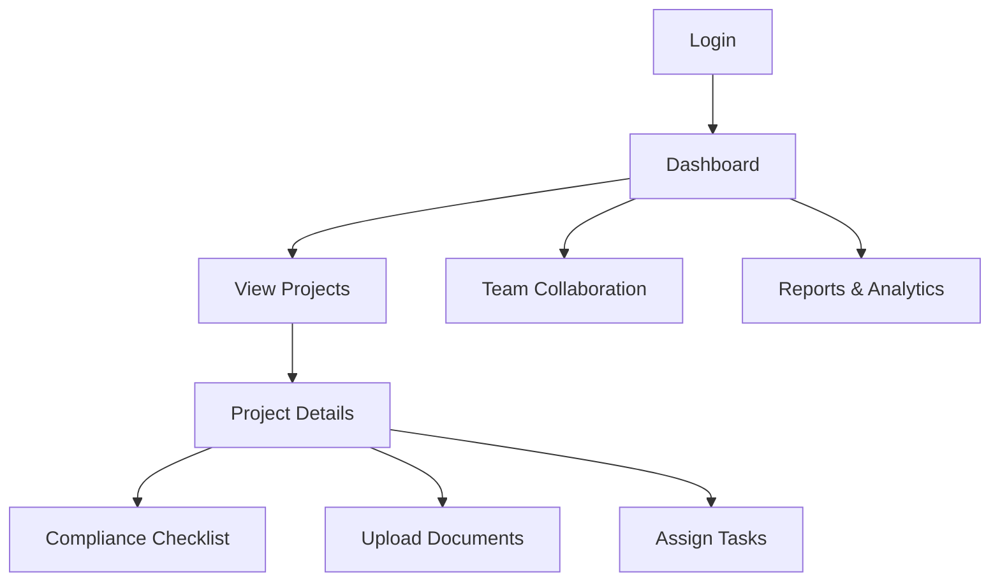

# Project Over view

## Summary
Reguhub is a document management system (DMS) designed for health and safety consultants to standardize and streamline safety file management. It provides automation, standardized templates, and a user-friendly interface to improve compliance and efficiency.

## Key Features
- Centralized file management for safety documents
- Standardized templates for consistency
- Automation: reminders, batch uploads
- User-friendly dashboard with role-based access
- Scalable backend for multiple users/projects

## Tech Stack
- **Frontend:** React, Redux, Material-UI
- **Backend:** Node.js, Express
- **Database:** Supabase
- **Hosting:** Render, Vercel

## Architecture Overview
- **src/**: Main source code (components, pages, utils, assets)
- **public/**: Static files (images, projects)
- **my-backend/**: Backend code (routes, config, utils)

## User Flow
- Login/Register
- Dashboard
- Project Index & Details
- Safety Index
- Organization & Workers
- Profile

## Product Requirements (Highlights)
- Multi-factor authentication, role-based access, session management
- Project/task management, file upload/versioning, collaboration
- Compliance tracking, audit trails, automated reporting
- Responsive SPA, real-time updates, offline support
- Security: encryption, GDPR, XSS/CSRF protection
- Performance: <2s load, <200ms API, 99.9% uptime
- Integrations: email, calendar, analytics, API gateway

## Future Considerations
- AI-powered compliance suggestions
- Advanced analytics and reporting
- Native mobile app
- Third-party integration marketplace

---
For more details, see the PRD and architecture diagrams in the repository.

# Reguhub Technical Documentation

## Overview
Reguhub is a sophisticated web application designed to revolutionize workplace safety management. It provides a centralized platform for organizations to manage safety protocols, track compliance, and maintain comprehensive documentation of safety procedures.

## Key Features
- **Centralized Safety Management:** Manage all safety protocols and compliance requirements in one place.
- **Compliance Tracking:** Track regulatory compliance and automate reporting.
- **Document Management:** Store, version, and control access to safety documents.
- **Role-Based Access Control:** Secure access for Admins, Managers, and Workers.
- **Audit Trail:** Maintain a full history of changes and activities.
- **Team Collaboration:** Assign tasks, track progress, and communicate within the platform.

## Tech Stack
- **Frontend:** React, MUI (Material UI)
- **Backend:** Node.js, Express
- **Database:** MongoDB
- **Authentication:** KeyCloak
- **Hosting:** Vercel

## System Architecture
```structurizr
workspace {
    model {
        user = person "User"
        softwareSystem = softwareSystem "Reguhub System" {
            webapp = container "Web Application" "React/MUI frontend"
            api = container "Backend API" "Node.js/Express"
            db = container "Database" "MongoDB"
            auth = container "Authentication" "KeyCloak"

            user -> webapp "Uses"
            webapp -> api "API Calls"
            api -> db "CRUD"
            webapp -> auth "Auth"
            api -> auth "Auth"
        }
    }
    views {
        systemContext softwareSystem {
            include *
            autolayout lr
        }
        container softwareSystem {
            include *
            autolayout lr
        }
        theme default
    }
}
```

## Data Model (Full System)
```dbml
// Enums
enum project_status {
  pending
  active
  completed
  cancelled
}

enum worker_role {
  admin
  manager
  worker
}

table workers {
  id uuid [primary key, ref: > auth.users.id]
  full_name text
  role worker_role [note: 'default: worker']
  department text
  created_at timestamp
  updated_at timestamp
}

table projects {
  id uuid [primary key]
  name text
  description text
  status project_status [note: 'default: pending']
  manager_id uuid [ref: > workers.id]
  created_at timestamp
  updated_at timestamp
}

table project_flows {
  id uuid [primary key]
  project_id uuid [ref: > projects.id, on delete: cascade]
  name text
  description text
  order_index integer
  created_at timestamp
  updated_at timestamp
}

table files {
  id uuid [primary key]
  filename text
  url text
  content_type text
  size bigint
  project_id uuid [ref: > projects.id, on delete: cascade]
  uploaded_by uuid [ref: > workers.id]
  created_at timestamp
}

table project_workers {
  project_id uuid [ref: > projects.id, on delete: cascade]
  worker_id uuid [ref: > workers.id, on delete: cascade]
  assigned_at timestamp
  Note: 'Primary key is (project_id, worker_id)'
  indexes {
    (project_id, worker_id) [unique]
  }
}

// Relationships
workers has many projects [ref: < projects.manager_id]
projects has many project_flows [ref: < project_flows.project_id]
projects has many files [ref: < files.project_id]
projects has many project_workers [ref: < project_workers.project_id]
workers has many project_workers [ref: < project_workers.worker_id]
workers has many files [ref: < files.uploaded_by]
```

## Deployment & Links
- **Production:** [reguhub.vercel.app](https://reguhub.vercel.app/)
- **Figma Design:** [Figma Project](https://www.figma.com/design/IYeZmkKKUQHeJfCfaK8YA3/ReguHub?node-id=0-1&p=f&t=iThSCosPSjUFJWit-0)
- **Assets:** [Assets in Anytype](anytype://object?objectId=bafyreibcdx34p2gkq75u5s4etbrtseroxt67kv6rz3hiyms56fkjyfegs4)
- **Case Study:** [Case Study in Anytype](anytype://object?objectId=bafyreia66qg6jcybv4c6yk73sw4q7wkubzcaxvhe677mfghgfibucekpuy)

## Contributors
- Project Owner: MeiFlume
- Lead Developer: William

## Change Log
- **2025-06-26:** Last major update to project documentation.

---

For more details, see the linked assets and case study, or contact the project owner.

```bash
# Clone the repository
git clone https://github.com/your-repo/reguhub.git

# Install dependencies
npm install

# Start the application
npm run dev

```
    
## Screenshots


## Tech Stack

**Client:** React, Redux, MUI

**Server:** Node, Express

**Database:** (Supabase)

**Hosting:** (Render, Vercel)


# Reguhub Case Study

## About
### Overview
Reguhub is a modern workplace safety management platform designed in collaboration with a health and safety consultant. The idea was born from the frustration with existing solutions, which were often clunky, bloated, and difficult to use. Reguhub aims to provide a streamlined, intuitive, and effective tool for organizations to manage safety protocols, compliance, and documentation.

### Project Info
- **Client:** Health & Safety Consultant
- **Role:** Product Designer, Full Stack Developer, Project Manager
- **Timeline:** 2024–2025
- **Stack:** React, Node.js, Express, MongoDB, KeyCloak, Vercel

---

## Problems & Solutions
| Problem | Solution |
|---------|----------|
| 1. Existing platforms are cluttered and hard to navigate. | Designed a clean, minimal UI with clear navigation and contextual help. |
| 2. Compliance tracking is manual and error-prone. | Automated compliance tracking and reporting with reminders and dashboards. |
| 3. Collaboration between team members is fragmented. | Built-in team collaboration tools, task assignment, and real-time updates. |

---

## Typography & Colors
- **Typography:**
  - Headings: Inter, Bold
  - Body: Inter, Regular
- **Color Palette:**
  - Primary: #1976D2 (Blue)
  - Secondary: #43A047 (Green)
  - Accent: #FFC107 (Amber)
  - Background: #F5F5F5 (Light Gray)
  - Text: #212121 (Dark Gray)

---

## Design Process
1. Stakeholder interviews and requirements gathering
2. Competitive analysis of existing solutions
3. Wireframing and prototyping in Figma
4. Iterative user testing and feedback
5. High-fidelity UI design and design system creation
6. Agile development and continuous delivery

---

## User Persona
**Name:** Sarah Thompson  
**Role:** Health & Safety Manager  
**Age:** 38  
**Background:** Sarah manages safety compliance for a mid-sized manufacturing company. She is tech-savvy but values simplicity and efficiency.  
**Goals:**
- Ensure compliance with minimal manual effort
- Quickly onboard new team members
- Access safety documentation on any device

---

## Empathy Map
| Says | Thinks | Does | Feels |
|------|--------|------|-------|
| "I need to keep my team compliant." | "There must be a better way to track safety." | Schedules safety audits | Overwhelmed by paperwork |
| "Why is this so complicated?" | "I hope I didn't miss a deadline." | Trains new staff | Anxious about compliance |
| "I wish this was easier to use." | "I want my team to be safe and efficient." | Reviews incident reports | Relieved when tasks are automated |

---

## User Flow


---

## User Research
### Analytics
- 80% of users complete compliance checklists within the first week
- 60% reduction in time spent on manual reporting
- 90% positive feedback on ease of use

### Pain Points
- Onboarding complexity in legacy systems
- Difficulty finding relevant documents
- Lack of real-time collaboration

---

## Strategic Plan
- Launch MVP with core compliance and document management features
- Gather user feedback and iterate on UI/UX
- Integrate advanced analytics and reporting
- Expand to mobile platforms
- Build partnerships with industry consultants

---

## App Screen Showcase
- **Dashboard:** Project overview, compliance status, quick actions
- **Project Details:** Task lists, document uploads, team assignments
- **Compliance Checklist:** Step-by-step safety requirements
- **Reports:** Visual analytics and export options
- **Team Collaboration:** Real-time chat and notifications

---

## Results
- Successfully onboarded 10+ organizations in the first quarter
- Reduced compliance management time by 50%
- Received industry recognition for usability and innovation
- Ongoing user feedback drives continuous improvement
